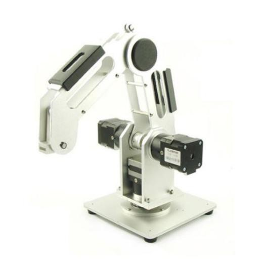
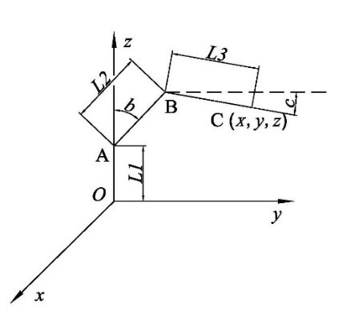
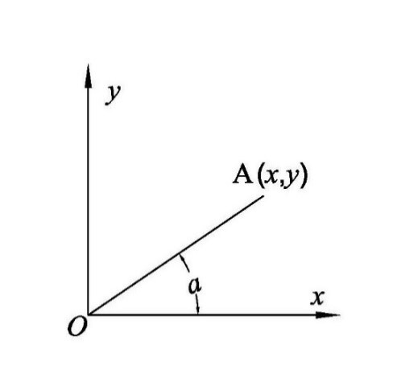
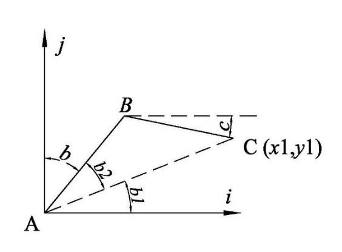

# 三轴机械臂控制

## 三轴机械臂逆运动学

底座角度
$$
a=arctan\frac{y}{x}
$$

$$
x_1=\sqrt{x^2+y^2}, y_1=z-L_1
$$

$$
b_1=arctan\frac{y_1}{x_1}
$$
根据余弦定理
$$
b_2=\frac{L_2^2+x_1^2+y_1^2-L_3^2}{2L_2\sqrt{x_1^2+y_1^2}},\angle ABC=\frac{L_2^2+L_3^2-(x_1^2+y_1^2)}{2L_2L_3}
$$

所以

$$\begin{aligned}
b&=\frac{\pi}{2}-b_1-b_2 \\
&=\frac{\pi}{2}-arctan\frac{y_1}{x_1}-\frac{L_2^2+x_1^2+y_1^2-L_3^2}{2L_2\sqrt{x_1^2+y_1^2}}\\
c&=\pi-(\frac{\pi}{2}-b)-\angle ABC \\
&=b-\frac{L_2^2+L_3^2-(x_1^2+y_1^2)}{2L_2L_3}+\frac{\pi}{2}
\end{aligned}$$

